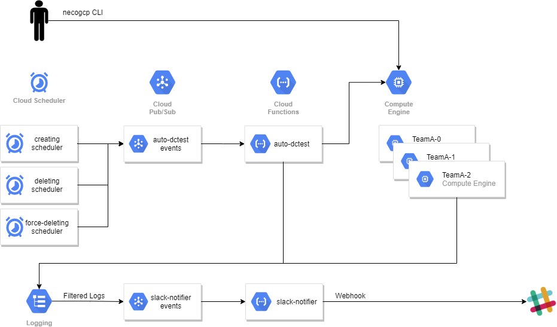

Automatic Neco Environment Construction with GCP (auto-dctest)
==============================================================

Overview
--------

This document describes the system which constructs [Neco](https://github.com/cybozu-go/neco) environment automatically on Google Cloud Platform(GCP).

### Features

1. Automatic Neco environment construction at the fixed time every buisiness day
2. Automatic deletion of the environment
3. Manual management of the environment with `necogcp` command
4. Slack notification when the environment is created/deleted
5. Multi-team support

### Architecture



This system consists of the following two types of components:

- `auto-dctest`: create/delete VM instances
  - Cloud Scheduler(to create VM): triggered at 9:00AM
  - Cloud Scheduler(to delete VM): triggered at 8:00PM
  - Cloud Scheduler(to force-delete VM): triggered at 11:00PM
  - Cloud Pub/Sub: messaging queue to accept messages from Cloud Scheduler
  - Cloud Function: workload to create/delete VM instances
    - This will create the specified number of instances for each team.  
    - Instances are named with the format `<team_name>-<index>`.  
      For example, `sample-0` and `sample-1` are created if team_name = sample and
      instance num = 2.  
      If `sample-0` already exists before creating, this function does nothing for it.
    - Neco/[neco-apps](https://github.com/cybozu-go/neco-apps) are started using (startup-script)[https://cloud.google.com/compute/docs/startupscript]
- `slack-notifier`: notify messages via Slack
  - Cloud Logging Sink: filters the string `[auto-dctest]` and push events to Cloud Pub/Sub
  - Cloud Pub/Sub: messaging queue to accept messages from Cloud Logging Sink
  - Cloud Function: workload to notify messages via Slack

`slack-notifier` notifies messages based on the texts in the logs pushed by `auto-dctest`.
If the text has the `[auto-dctest]` string in the text, Cloud Logging Sink will filter it and
push events to Cloud Pub/Sub.

`auto-dctest` and `slack-notifier` can be used independently, which means that `auto-dctest` can be used without `slack-notifier` and `slack-notifier` can be used without `auto-dctest`.

Usage
-----

Note that the word instance means VM instance on Google Compute Engine.

### Before deployment

TODO: Quota limitation settings for your safety

### Deploy `auto-dctest` Function

Create `auto-dctest` function and schedulers for deletion:
```
export GCP_PROJECT=<project>
make -f Makefile.dctest init`
```

Create a scheduler for creation per each team:
```
export GCP_PROJECT=<project>
make -f Makefile.dctest add-team TEAM_NAME=<team_name> INSTANCE_NUM=<num>
make -f Makefile.dctest list-teams
```

When you want to destroy:
```
export GCP_PROJECT=<project>
make -f Makefile.dctest list-teams
make -f Makefile.dctest delete-team TEAM_NAME=<team_name>
make -f Makefile.dctest clean
```

### Deploy `slack-notifier` Function

Create `slack-notifier` function and logging sink:
```
export GCP_PROJECT=<project>
make -f Makefile.slack init`
```

When you want to destroy:
```
export GCP_PROJECT=<project>
make -f Makefile.slack clean`
```

### Slack notifications

`auto-dctest` can notify the following events via Slack:
1. Starting instance creation
2. Finished `cybozu-go/neco` DC test bootstrap
3. Finished `cybozu-go/neco-apps` DC test bootstrap
4. Deleting the instance

To enable Slack notification, you need to prepare a YAML setting file:
```yaml
teams:
  team1: https://<your>/<slack>/<webhook>/<url>
severity: # See https://api.slack.com/reference/messaging/attachments#fields
  - color: good
    regex: ^INFO
  - color: warning
    regex: ^WARN
  - color: danger
    regex: ^ERROR
rules:
  - name: team1-rule
    regex: team1-+[0-9]
    targetTeams:
      - team1
```
With the above setting, the notifications for `team1`'s instance with postfix `-+[0-9]` will be sent to `team1`'s Slack webhook.

This YAML file must be uploaded to Secret Manager with the specific name `slack-notifier-config`.


### Manual management with `necogcp` command

Neco environment can be created with `necogcp neco-test` commands.

#### `create-instance`

| Flag (short)      | Default Value                          | Description                   |
| :---------------- | :------------------------------------- | :---------------------------- |
| project-id (p)    | -                                      | Project ID for GCP (required) |
| zone (z)          | asia-northeast1-c                      | Zone name for GCP             |
| machine-type (t)  | n1-standard-32                         | VM Machine type               |
| instance-name (n) | -                                      | Instance name (required)      |
| neco-branch       | Branch of `cybozu-go/neco` to run      | release                       |
| neco-apps-branch  | Branch of `cybozu-go/neco-apps` to run | release                       |

#### `delete-instance`

| Flag (short)      | Default Value     | Description                   |
| :---------------- | :---------------- | :---------------------------- |
| project-id (p)    | -                 | Project ID for GCP (required) |
| zone (z)          | asia-northeast1-c | Zone name for GCP             |
| instance-name (n) | -                 | instance name (required)      |

#### `list-instances`

| Flag (short)   | Default Value     | Description                   |
| :------------- | :---------------- | :---------------------------- |
| project-id (p) | -                 | Project ID for GCP (required) |
| zone (z)       | asia-northeast1-c | Zone name for GCP             |
| filter (f)     | -                 | Filter string                 |


### Administration

#### Holiday list

The scheduler for `auto-dctest` skips weekend (Saturday and Sunday) and holidays.  The holiday list is hard-coded in [`holiday.go`](../holiday.go), so an administrator should modify it periodically.

#### Team management

To add a team, an administrator should run `make -f Makefile.dctest add team` and modify Slack settings and upload it to Secret Manager.


### For developer

[`cmd/dev`](../cmd/dev) includes commands, which are equivalent to the Cloud Functions executed by `auto-dctest`. These are useful if you want to debug the Cloud Function without deploying.
